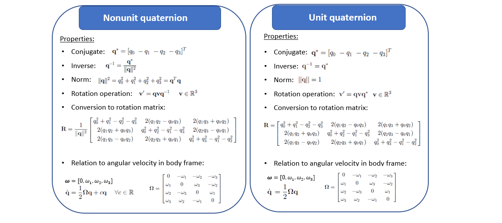
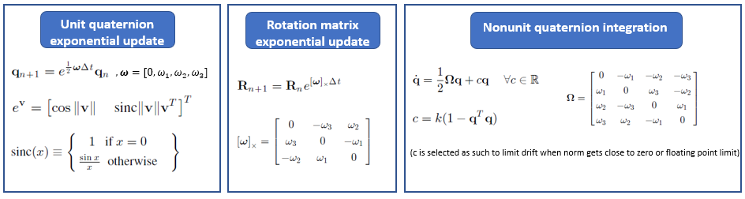
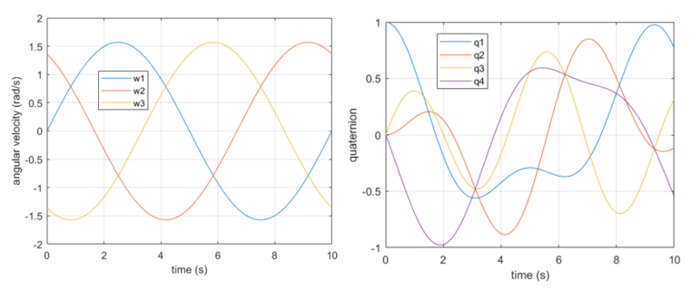
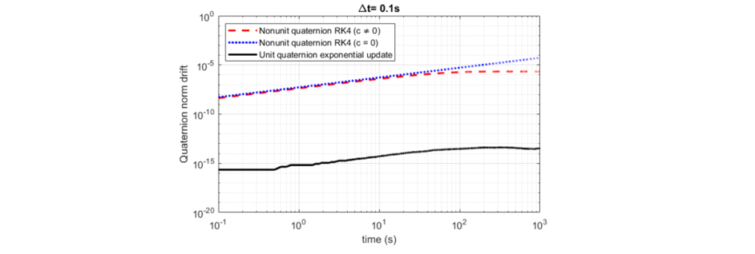
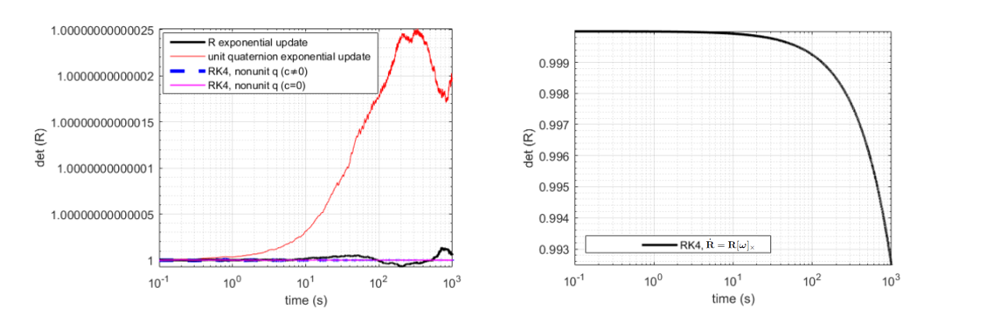
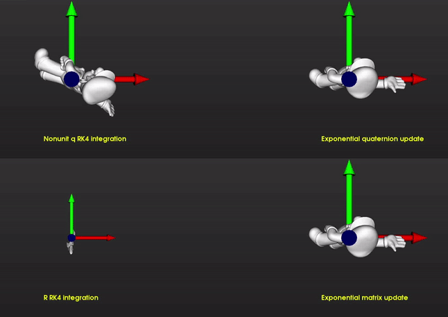
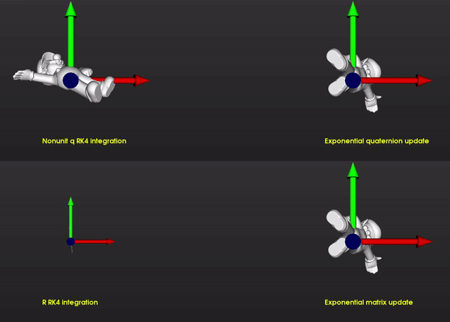

# Integrating Rigid Body Rotations

I've been working on angular velocity estimation of an object from noisy pose measurements, which is a common problem in augmented reality and surgical applications. To test my algorithms, I needed to do the opposite and generate simulated noisy rotation measurements from a known angular velocity profile. That turned into a project as well. I came across to this beautifully and clearly written paper below, which made me question numerous papers I've read that restricted their formulation to unit quaternions and stated 
the algebraic unit norm constraint as an inconvenience that comes at a price of having the computational efficiencies of using quaternions.

Rucker, Caleb. "Integrating rotations using nonunit quaternions." IEEE Robotics and Automation Letters 3.4 (2018): 2979-2986.

Below is a summary of the implementation of the paper and some test results.

**Properties of quaternions:** The properties of nonunit and unit quaternions are as follows:

The paper shows that the ODE that relates the unit quaternion derivative to angular velocity in body frame is the  minimum norm solution to the general form of the equation for nonunit quaternion. The parameter c is defined as such to minimize the drift of the quaternion norm. Note that this is only necessary if norm gets close to zero or floating point limit. The equations for converting quaternion to rotation matrix is different for nonunit quaternions. Therefore, as long as you're consistent with this notation and you do the normalization during conversion, the drift in integration should not have an affect on the rotation matrix. The paper also gives a simple example where angular velocity depends on rotation calculation and shows that the momentum conservation of nonunit quaternion approach is similar.

**Integration of angular velocity using exponential update and non-unit quaternions:** The table below shows the equations for different implementations presented in the paper. The exponential methods are very common in robotics and aerospace applications to preserve the structure of SO(3).Indeed, the algorithm that I mentioned above and will share later  uses the exponential update rule in the process model of a kalman filter. The paper shows that you can use nonunit quaternions with a standard ODE solver like Runge-Kutta and get better results that exponential update method which assumes constant velocity or constant acceleration between measurements.

**Test Results** Here's a test data generated by integrating a given angular velocity profile using RK4 and normalizing the quaternion at the end of each iteration.

Here's the drift in quaternion norm for different implementations. You can see the c parameter limiting the norm as time progresses.

Here's the determinant of the rotation matrix obtained using exponential update with unit quaternions, exponential update using rotation matrices, integration of nonunit quaternions with RK4 (c=0) and integration of nonunit quaternions with RK4, where we apply the drift limit factor c is nonzero and applied at every iteration. As you can see the drift doesn't affect the rotation matrix since the normalization is captured during conversion. Overall, the approach in the paper gives better results than the exponenial update method here. On the right, you also see the integration of the rotation matrix elements using RK4, which clearly shows that you need an [orthogonalization](https://en.wikipedia.org/wiki/Gram–Schmidt_process) step after that (hopefully this approach fell out of practice completely).

I applied the resulting rotation matrices in simulation to rotate Super Mario using integration step size Δt=0.5, angular velocity weights a=0.5π/2, b=0.4π/10.
As you can see in bottom left corner, integrating rotation matrix elements no longer provides rigid body transformation. I don't really see a noticable difference between the 3 approaches at the beginning of the simulation.

Here's the result after running the simulation close to 10000s:

Here's the result after running the simulationnclose to 20000s:

Here's the total time it took to generate the data in Matlab:

RK4 nonunit quaternion integration:
Elapsed time is 18.559915 seconds.

RK4 nonunit quaternion integration (c=0):
Elapsed time is 17.654188 seconds.

Quaternion exponential update:
Elapsed time is 5.580483 seconds.

Rotation matrix exponential update:
Elapsed time is 17.477849 seconds.

RK4  rotation matrix integration:
Elapsed time is 52.569202 seconds.

Enjoy!

**Files:**
* /code/sim.py : python script used to animate super mario. It uses [vtk](https://vtk.org/).
* /code/generate_sim_data.m : main matlab file that generates the figures above

